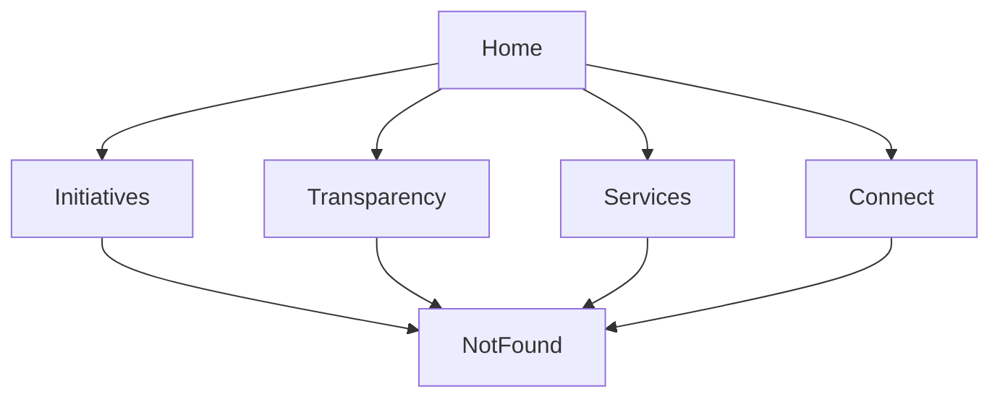

# Suryapura Portal Architecture

## 1. Overview

Suryapura Portal is a modern React + Vite single-page experience for a fictional rural development platform. The app is designed as a premium, bilingual, responsive, and accessible marketing + civic portal that highlights governance, services, transparency, and community initiatives.

## 2. Core Goals

- Deliver a polished public-facing portal experience
- Support English and Hindi content seamlessly
- Provide light/dark theme switching
- Keep the UI responsive across mobile, tablet, and desktop
- Make future expansion easy through modular components and layout-driven routes

## 3. Technology Stack

- React 19 for UI composition
- Vite 8 for development and production builds
- React Router for route-based navigation
- Tailwind CSS for styling and responsive UI
- Framer Motion + GSAP + Lenis for animation and smooth scrolling
- React Helmet Async for SEO metadata
- Lucide React for icons

## 4. Project Structure

```text
src/
  App.jsx
  main.jsx
  index.css
  assets/
    icons/
    illustrations/
    lottie/
  components/
    common/
      Badge.jsx
      Button.jsx
      Card.jsx
      OptimizedImage.jsx
      SEO.jsx
      Typography.jsx
    layout/
      BackToTop.jsx
      CommandSearch.jsx
      Container.jsx
      Footer.jsx
      LoadingScreen.jsx
      Navbar.jsx
      PageTransition.jsx
      ScrollProgress.jsx
      SkipLink.jsx
  config/
    constants.js
  context/
    GlobalProviders.jsx
  hooks/
  layouts/
    MainLayout.jsx
  pages/
    Home.jsx
    Initiatives.jsx
    Transparency.jsx
    Services.jsx
    Connect.jsx
    NotFound.jsx
  routes/
    AppRoutes.jsx
  utils/
    cn.js
    formatters.js
```

## 5. Architectural Layers

### App Shell

- Entry point is handled by [src/main.jsx](../src/main.jsx)
- The app mounts the global providers and router

### Provider Layer

- [src/context/GlobalProviders.jsx](../src/context/GlobalProviders.jsx) manages:
  - theme state
  - language state
  - accessibility-related state

### Layout Layer

- [src/layouts/MainLayout.jsx](../src/layouts/MainLayout.jsx) provides the shared shell:
  - navbar
  - main content area
  - footer
  - scroll behavior
  - skip link and back-to-top

### Route Layer

- [src/routes/AppRoutes.jsx](../src/routes/AppRoutes.jsx) maps URL paths to page components

### Page Layer

Each page is a self-contained experience:

- Home for storytelling and hero content
- Initiatives for developmental programs
- Transparency for public governance data
- Services for citizen services
- Connect for support and contact
- NotFound for fallback route

### UI Component Layer

Shared components live in [src/components/common](../src/components/common) and [src/components/layout](../src/components/layout) for reuse across pages.

## 6. State Management Strategy

The project uses a lightweight architecture:

- Local component state for component-level UI interactions
- Context for app-wide state such as theme, language, and accessibility preferences
- No backend or database layer is required for the current demo version

This keeps the project simple while remaining extensible for future API integration.

## 7. Theme and Localization Flow

### Theme

- Tailwind dark mode is driven by a root class toggle
- Theme preference is stored in local storage
- The application uses a consistent dark-mode surface structure across sections

### Language

- English and Hindi content are managed through localized objects inside page components
- The active locale is provided via the global provider

## 8. Routing Model



## 9. Performance Considerations

- Vite-based build pipeline for fast development and production builds
- Chunks are split for React, animation, and UI dependencies
- Images are used through optimized asset patterns and lazy loading where appropriate
- Lenis improves perceived scrolling smoothness

## 10. Future Extension Points

The architecture is ready for future additions such as:

- CMS-driven content
- real backend APIs
- form submissions and notifications
- analytics and tracking
- admin dashboard for content updates

## 11. Recommended Development Pattern

When adding features:

1. Keep page-specific logic inside the relevant page component
2. Reuse shared components from the common/layout folders
3. Place global behavior in context providers
4. Keep styling consistent with Tailwind and the existing dark/light tokens
5. Add new routes in the router configuration only
